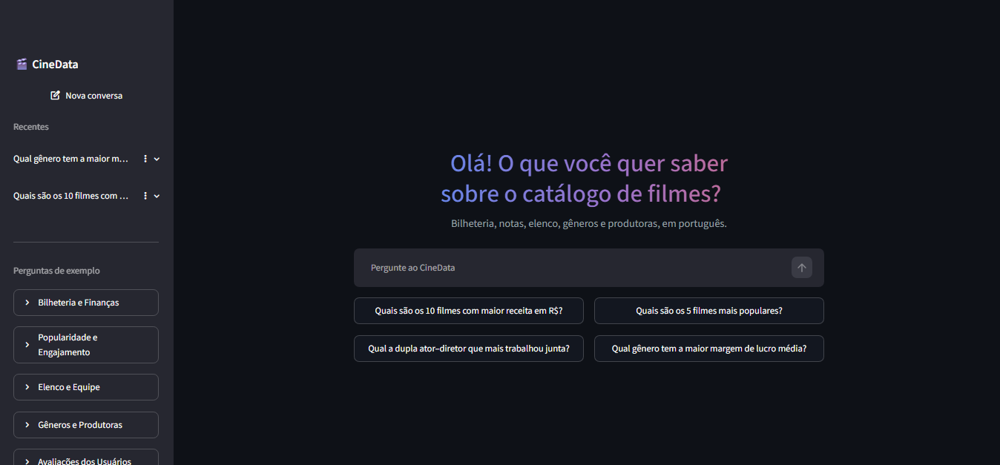
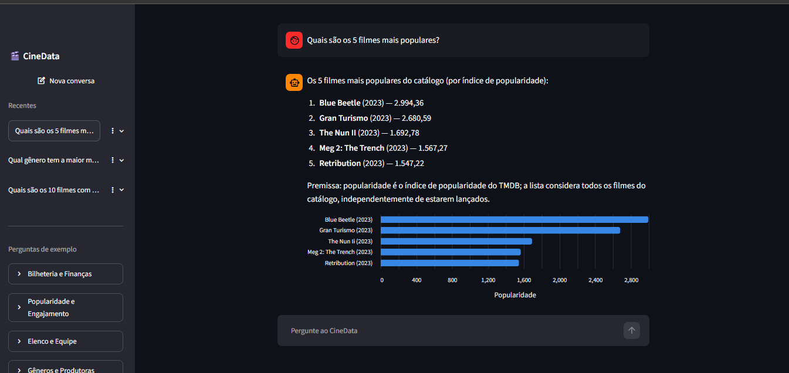
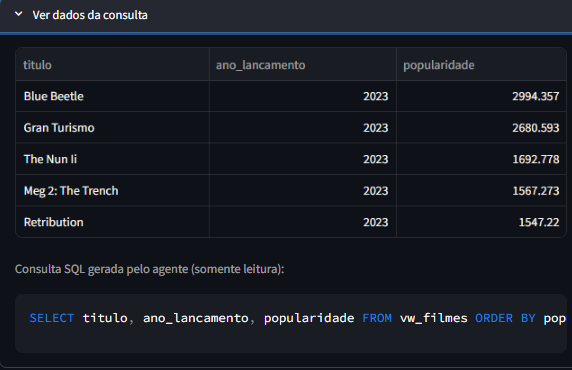

<h1 align="center">🎬 CineData Analytics</h1>

<p align="center">
  Agente de IA que responde, em português, perguntas sobre o catálogo de filmes da CineData,<br/>
  traduzindo cada pergunta em SQL sobre a camada Gold (<strong>Text-to-SQL</strong>).<br/>
  Atividade GenAI do <strong>Visagio Rocket Lab 2026.2</strong>.
</p>

<p align="center">
  
  
  
  
  
  
</p>

---

## Sumário

- [Sobre o projeto](#sobre-o-projeto)
- [Funcionalidades](#funcionalidades)
- [Demonstração](#demonstração)
- [Como o agente funciona](#como-o-agente-funciona)
- [Tecnologias](#tecnologias)
- [Arquitetura e organização](#arquitetura-e-organização)
- [Dados e regras de negócio](#dados-e-regras-de-negócio)
- [Avaliação do agente](#avaliação-do-agente)
- [Como executar](#como-executar)
- [Limites da conta gratuita](#limites-da-conta-gratuita)
- [Testes](#testes)
- [Limitações conhecidas](#limitações-conhecidas)
- [Padrão de commits](#padrão-de-commits)
- [Autor](#autor)

---

## Sobre o projeto

A **CineData Analytics** é uma empresa de inteligência de mercado audiovisual cujo Data Lakehouse foi estruturado na atividade de Engenharia de Dados. Este projeto coloca esses dados nas mãos de quem **não sabe SQL**: o usuário escreve uma pergunta em linguagem natural ("Quais os 10 filmes com maior receita em R$?") e o agente:

1. entende a pergunta;
2. escreve uma consulta SQL de **somente leitura** sobre a camada Gold (`cinerocket.db`, SQLite com as 10 tabelas do modelo dimensional);
3. executa a consulta em tempo real;
4. responde em português, com os números formatados, um gráfico quando ajuda e a tabela com os dados.

O agente usa **modelos gratuitos do OpenRouter** (sufixo `:free`, com suporte a *tool calling*) e foi construído com o framework **PydanticAI**.

---

## Funcionalidades

### Requisitos da atividade

| Requisito | Como foi atendido |
|---|---|
| Agente que permite perguntas em linguagem natural sobre o catálogo | Agente PydanticAI com a ferramenta `run_sql` ([agent.py](src/cinedata_agent/agent.py)) |
| Consultas de leitura diretamente sobre a camada Gold (Text-to-SQL) | O agente gera SQL e o executa no `cinerocket.db`, em modo somente leitura ([db.py](src/cinedata_agent/db.py)) |
| Framework de agentes à escolha | **PydanticAI** (indicado no roadmap de estudos) |
| Modelo à escolha (sugestão: `:free` via OpenRouter, com *tool calling*) | `qwen/qwen3.8-27b:free`, `google/gemma-4-26b-a4b-it:free` e `nvidia/nemotron-3.5-lightning:free` |
| Linguagem Python | Python 3.11+ |
| Entregável: projeto Python | Pacote `cinedata_agent` + interface Streamlit + linha de comando |
| Versionado no GitHub com README do passo a passo | Este repositório e a seção [Como executar](#como-executar) |
| Planejar os testes por causa do limite de 50 requisições/dia | Cache de respostas, testes sem LLM e limite de requisições por pergunta ([detalhes](#limites-da-conta-gratuita)) |

### Categorias de perguntas

O agente responde às perguntas de todas as categorias da atividade (e a qualquer outra sobre o catálogo). Todas as perguntas abaixo fazem parte da [suíte de avaliação](#avaliação-do-agente) e aparecem como exemplos clicáveis na interface.

| Categoria | Perguntas da atividade | Perguntas extras |
|---|---|---|
| **Bilheteria e Finanças** | Top 10 filmes com maior receita em R$ · Lucro médio por gênero · Filmes com maior margem de lucro | 5 filmes de terror com maior bilheteria · 5 filmes que deram mais prejuízo · Receita total por ano |
| **Popularidade e Engajamento** | Os 5 filmes mais populares · Maior divergência entre nota TMDB e IMDb · Nota média IMDb por ano | 10 mais bem avaliados no IMDb (≥ 1.000 votos) · Popularidade média por gênero |
| **Elenco e Equipe** | Ator com mais filmes nos últimos 5 anos · Diretores com maior nota média (mín. 5 filmes) · Dupla ator–diretor que mais trabalhou junta | Em quantos filmes Scarlett Johansson atuou · Filmes dirigidos por Christopher Nolan |
| **Gêneros e Produtoras** | Quantidade de filmes por gênero · Produtora com maior lucro total · Gênero com maior margem de lucro média | Gênero com maior receita total · Filmes de animação por ano |
| **Avaliações dos Usuários** | Filmes mais avaliados pelos usuários · Maior divergência entre a nota dos usuários e a do IMDb | Filmes com pelo menos 5 avaliações · Total de avaliações |

> "Receita", "faturamento" e "bilheteria" são tratados como sinônimos.

### Funcionalidades extras

Das sugestões da atividade, o projeto implementa:

- **Guardrails**: três camadas impedem qualquer alteração no banco. O SQL gerado é validado com `sqlglot` (só aceita uma consulta `SELECT`/`WITH` sobre tabelas permitidas), o próprio SQLite nega qualquer ação que não seja leitura e o arquivo é aberto em modo somente leitura. Pedidos como "apague os filmes de terror" são recusados.
- **Interface visual**: chat em Streamlit no estilo do Gemini, com tema escuro, sugestões de perguntas na tela inicial e exemplos por categoria.
- **Histórico de conversas**: as conversas ficam salvas na barra lateral (inclusive ao recarregar a página) e podem ser reabertas, fixadas no topo ou excluídas.
- **Gráficos**: barras para rankings e linha para séries por ano, escolhidos automaticamente pelo formato do resultado.
- **Fallback entre modelos gratuitos**: se o modelo principal estiver lotado ou demorar mais de 45 s, o próximo assume sozinho.
- **Cache de respostas**: uma pergunta repetida (mesmo com outra pontuação ou sem acentos) volta na hora, sem gastar requisições.
- **Avaliação**: 28 perguntas com SQL de referência e um avaliador automático que mede a acurácia do agente.

---

## Demonstração

### Tela inicial



A tela inicial segue o estilo do Gemini: uma saudação no centro (**"Olá! O que você quer saber sobre o catálogo de filmes?"**) com a caixa **"Pergunte ao CineData"** logo abaixo. Embaixo dela ficam quatro **sugestões de perguntas**, uma de cada tipo de análise; basta clicar em uma para enviá-la. Na barra lateral estão o botão **Nova conversa**, a lista de conversas **Recentes** e as **perguntas de exemplo**, agrupadas nas cinco categorias de análise da atividade.

### Conversa com gráfico e histórico



Exemplo da pergunta **"Quais são os 5 filmes mais populares?"**. O agente responde com a lista numerada (título, ano e índice de popularidade no padrão brasileiro), explica a premissa usada e gera um **gráfico de barras horizontais** na ordem do ranking; passar o mouse sobre uma barra mostra o valor exato. Depois da primeira pergunta, a caixa de pergunta vai para o rodapé, e as próximas perguntas continuam na mesma conversa.

Na barra lateral, a conversa aberta aparece destacada em **Recentes**, com o título da primeira pergunta. As conversas ficam salvas mesmo ao recarregar a página: clicar em uma delas reabre as respostas, os gráficos e as tabelas sem consultar o modelo de novo. O menu **⋮** de cada conversa permite **fixá-la** no topo da lista (📌) ou **excluí-la**.

### Dados da consulta



Abaixo de cada resposta fica o painel **Ver dados da consulta**. Ele mostra a tabela com o resultado que embasou a resposta (no exemplo, título, ano de lançamento e popularidade) e a **consulta SQL gerada pelo agente**, sempre de somente leitura. Assim, quem quiser pode conferir de onde vieram os números.

---

## Como o agente funciona

```text
Pergunta em português
        │
        ▼
 ┌──────────────┐  já respondida?  ┌───────────────────────────┐
 │    Cache     │ ───────────────► │ resposta imediata (0 req.) │
 └──────────────┘                  └───────────────────────────┘
        │ não
        ▼
 ┌─────────────────────────────────────────────────────────────┐
 │ Agente PydanticAI                                           │
 │ system prompt = dicionário de dados + regras de negócio     │
 │ modelos: Qwen → Gemma → Nemotron (fallback automático)       │
 └─────────────────────────────────────────────────────────────┘
        │ chama a ferramenta run_sql(consulta)
        ▼
 ┌──────────────┐   ┌────────────────────┐   ┌──────────────────────┐
 │  Guardrails  │ → │ SQLite read-only   │ → │ resultado formatado  │
 │  (sqlglot)   │   │ + views limpas     │   │ (R$ mi/bi, %)        │
 └──────────────┘   └────────────────────┘   └──────────────────────┘
        │ SQL com erro? a mensagem volta ao modelo, que corrige (até 2x)
        ▼
 Resposta em português + gráfico + tabela + SQL
```

Uma pergunta típica usa **2 requisições** ao modelo: uma para gerar o SQL e outra para redigir a resposta. Para economizar a cota gratuita, o schema e as regras vão inteiros no *system prompt*, em vez de ferramentas extras de descoberta (como "listar tabelas"), que custariam uma requisição cada.

---

## Tecnologias

| Camada | Tecnologias |
|---|---|
| **Agente** | PydanticAI 2 (agente, *tool calling*, fallback de modelos) |
| **Modelos** | OpenRouter, modelos gratuitos `:free` com suporte a *tool calling* |
| **Banco de dados** | SQLite (`cinerocket.db`, camada Gold), módulo `sqlite3` do Python |
| **Guardrails** | `sqlglot` (análise do SQL) + *authorizer* do SQLite + conexão read-only |
| **Interface** | Streamlit (chat) + Altair (gráficos) |
| **Configuração** | `pydantic-settings` + arquivo `.env` |
| **Qualidade** | Pytest (168 testes, sem gastar cota) + suíte de avaliação com SQL de referência |

---

## Arquitetura e organização

O código fica em um pacote Python (`src/cinedata_agent`), com um módulo por responsabilidade. A interface Streamlit, a linha de comando e o avaliador usam a mesma fachada (`CineDataService`).

```text
cinedata-agent/
├── app/
│   └── streamlit_app.py      # Interface de chat no estilo Gemini (Streamlit)
├── src/cinedata_agent/
│   ├── agent.py              # Agente PydanticAI + ferramenta run_sql
│   ├── prompts.py            # System prompt: dicionário de dados e regras de negócio
│   ├── semantic.py           # Views "limpas" sobre a camada Gold
│   ├── db.py                 # Conexão somente leitura, timeout e limite de linhas
│   ├── guardrails.py         # Validação do SQL gerado (sqlglot)
│   ├── llm.py                # Modelos do OpenRouter, timeout e fallback
│   ├── service.py            # Fachada: banco + modelo + agente + cache
│   ├── cache.py              # Cache de respostas em SQLite
│   ├── history.py            # Histórico de conversas da interface (SQLite)
│   ├── charts.py             # Escolha e desenho automático do gráfico
│   ├── formatting.py         # R$ mi/bi, %, números no padrão brasileiro
│   ├── errors.py             # Mensagens de erro em português
│   ├── quota.py              # Consulta da cota diária do OpenRouter
│   ├── evaluation.py         # Comparação do resultado do agente com o gabarito
│   ├── config.py             # Configurações (.env)
│   └── cli.py                # Linha de comando
├── evals/
│   ├── casos.toml            # 28 perguntas com SQL de referência
│   ├── run_evals.py          # Executa a avaliação e gera o relatório
│   └── resultados/           # Relatórios gerados
├── tests/                    # Testes com pytest (modelos simulados, sem gastar cota)
├── docs/screenshots/         # Imagens usadas neste README
├── .streamlit/config.toml    # Tema escuro da interface
├── .env.example              # Modelo do arquivo de configuração
├── cli.py                    # Atalho: python cli.py "pergunta"
└── pyproject.toml            # Dependências do projeto
```

### Decisões técnicas

- **Schema no prompt**: o dicionário de dados vai no *system prompt*, então cada pergunta custa ~2 requisições em vez de 4 ou 5.
- **Camada semântica**: views temporárias (`vw_filmes`, `vw_filme_genero`, `vw_filme_pessoa`, `vw_filme_produtora`) aplicam as regras de limpeza uma única vez, em SQL. O modelo erra menos e o arquivo do banco nunca é alterado (ver [Dados e regras de negócio](#dados-e-regras-de-negócio)).
- **Defesa em camadas**: `sqlglot` + *authorizer* do SQLite + modo read-only. Mesmo um SQL que escapasse da primeira camada seria negado pelo próprio banco.
- **Autocorreção**: se o SQL falhar, a mensagem de erro volta ao modelo, que corrige a consulta (até 2 tentativas).
- **Teto de requisições**: no máximo 4 requisições por pergunta, para um modelo em loop não esgotar a cota.
- **Valores pré-formatados**: dinheiro e margem chegam ao modelo já como "R$ 1,04 mi" ou "76,0%". Num teste, um modelo apresentou R$ 1,0 mi como "R$ 1,0 mil"; formatar antes elimina esse tipo de erro.
- **Sem retentativas automáticas**: o cliente HTTP não repete requisições em erro 429, porque requisições que falham também contam na cota diária.
- **Tempo máximo por requisição**: 45 s. Pedidos parados na fila do modelo gratuito são abandonados e o próximo modelo assume.

---

## Dados e regras de negócio

Antes de escrever o agente, os dados da camada Gold foram analisados. Algumas armadilhas mudariam as respostas se não fossem tratadas:

| Situação nos dados | Tratamento |
|---|---|
| O lucro nunca é nulo: sem receita vale 0 ou −orçamento, e sem orçamento vale a receita inteira | Lucro só existe quando há receita **e** orçamento |
| Orçamentos e receitas irrisórios (ex.: US$ 4) distorcem a margem | Margem só é calculada quando ambos são ≥ US$ 10 mil |
| Média simples de margens por gênero dá negativa (fracassos com −100.000%) | Margem de grupo = lucro total ÷ receita total, com no mínimo 10 filmes |
| `nota_tmdb = 0` com zero votos significa "sem nota" | Vira nulo |
| 4 filmes têm a popularidade igual a um ano (ex.: 2018.0), erro de carga | Vira nulo |
| A cotação R$/US$ varia por filme | Valores em R$ usam sempre as colunas `_brl`, sem conversão |
| Filmes lançados vão até 2024 (2025 e 2026 têm só 4 filmes) | "Últimos 5 anos" = 2020 a 2024, só filmes lançados |
| Rankings de nota premiariam filmes com 1 voto | Mínimo de 50 votos por filme; "nota" sem plataforma = IMDb |
| Gêneros estão em inglês | A view traz o nome em português (Terror, Ficção Científica...) |
| A mesma pessoa tem um id por papel (ator, diretor) | Dupla ator–diretor junta a tabela de pessoas com ela mesma |

---

## Avaliação do agente

A suíte de avaliação ([evals/casos.toml](evals/casos.toml)) tem **28 perguntas**: as 14 da atividade, 11 extras e 3 de segurança e robustez (pedido para apagar dados, pergunta fora do tema e nome de gênero em português). Cada uma tem um **SQL de referência** conferido no banco.

A métrica é a **acurácia de execução**: o resultado da consulta do agente é comparado com o do SQL de referência. O avaliador tolera o que não muda a resposta (colunas a mais, outros nomes de coluna, arredondamento e empates em rankings).

| Execução | Resultado |
|---|---|
| 14 perguntas da atividade + 3 de segurança e robustez | **17/17** acertos · 33 requisições · 8,5 s em média por pergunta ([relatório](evals/resultados/relatorio.md)) |
| 11 perguntas extras | **11/11** acertos · 20 requisições |

---

## Como executar

### Pré-requisitos

- **Python 3.11+**
- **Git**
- Uma conta gratuita no **[OpenRouter](https://openrouter.ai)** (não precisa de cartão de crédito)

### 1. Clonar o repositório

```powershell
git clone https://github.com/luizfnogueira/cinedata-agent.git
cd cinedata-agent
```

### 2. Criar o ambiente virtual e instalar as dependências

```powershell
python -m venv .venv

# Windows (PowerShell)
.\.venv\Scripts\Activate.ps1
# Linux/macOS
# source .venv/bin/activate

pip install -e ".[dev]"
```

> Se o PowerShell bloquear o `Activate.ps1` por política de execução, rode antes
> `Set-ExecutionPolicy -Scope CurrentUser RemoteSigned`, ou use o Python do ambiente diretamente:
> `.\.venv\Scripts\python cli.py "sua pergunta"`.

### 3. Baixar o banco de dados

Baixe o arquivo **`cinerocket.db`** (~580 MB) na **[pasta do Google Drive da atividade](https://drive.google.com/drive/folders/19478J9a36_zdiMYd8aGxythohOFWj1zy)** e coloque-o na **raiz do projeto**, ao lado do `pyproject.toml`. O nome precisa ser exatamente `cinerocket.db`.

> O banco não está no repositório porque passa do limite de 100 MB do GitHub. Para usar outro caminho, defina `CINEDATA_DB_PATH` no `.env`.

### 4. Criar a chave gratuita do OpenRouter

1. Acesse **[openrouter.ai](https://openrouter.ai)** e crie uma conta (Google, GitHub ou e-mail).
2. Vá em **[openrouter.ai/keys](https://openrouter.ai/keys)** e clique em **Create Key**.
3. Copie a chave gerada (começa com `sk-or-v1-...`). Ela só aparece uma vez.

### 5. Configurar o `.env`

Copie o arquivo de exemplo:

```powershell
# Windows (PowerShell)
Copy-Item .env.example .env
# Linux/macOS
# cp .env.example .env
```

Abra o `.env` e cole a sua chave:

```dotenv
OPENROUTER_API_KEY=sk-or-v1-SUA_CHAVE_AQUI
```

As outras variáveis são opcionais (os padrões já funcionam):

| Variável | Padrão | Para que serve |
|---|---|---|
| `CINEDATA_MODELS` | Qwen → Gemma → Nemotron | Modelos `:free` e a ordem do fallback |
| `CINEDATA_DB_PATH` | `cinerocket.db` | Caminho do banco |

> O `.env` está no `.gitignore`: a chave nunca vai para o repositório.

### 6. Abrir a interface

```powershell
streamlit run app/streamlit_app.py
```

O navegador abre em **http://localhost:8501**. Escreva uma pergunta ou clique em um exemplo na barra lateral. A primeira abertura leva alguns segundos para carregar o catálogo.

### Linha de comando (opcional)

O agente também funciona pelo terminal, o que é útil para testes rápidos:

```powershell
python cli.py "Quais os 5 filmes mais populares?"   # uma pergunta
python cli.py                                       # modo conversa (digite 'sair' para encerrar)
python cli.py --cota                                # requisições gratuitas restantes hoje
python cli.py --sem-cache "..."                     # ignora respostas guardadas
python cli.py --modelo nvidia/nemotron-3.5-lightning:free "..."   # força um modelo
```

### Rodar a avaliação (opcional)

```powershell
python evals/run_evals.py --listar             # lista as perguntas (0 requisições)
python evals/run_evals.py --dry-run            # confere os SQLs de referência (0 requisições)
python evals/run_evals.py --ids fin-01 --mostrar   # uma pergunta, mostrando resposta e SQL
python evals/run_evals.py                      # todas as perguntas (~55 requisições)
```

> A avaliação completa gasta mais que a cota de um dia (50). Rode por categoria, por exemplo `--categoria Elenco`; as respostas ficam no cache e as próximas execuções não gastam nada.

Para **adicionar uma pergunta**, crie um bloco `[[casos]]` em [evals/casos.toml](evals/casos.toml) com a pergunta e o SQL de referência. Depois valide com `--dry-run --ids <id>`. As instruções de cada campo estão no topo do arquivo.

---

## Limites da conta gratuita

| Situação | Requisições/minuto | Requisições/dia |
|---|---|---|
| Sem créditos comprados | 20 | **50** |
| Comprou ≥ US$ 10 alguma vez | 20 | 1.000 |

O contador renova à **meia-noite UTC (21h no horário de Brasília)**, e requisições que falham também contam. Por isso o projeto:

- responde perguntas repetidas pelo **cache**, sem gastar nada;
- limita cada pergunta a **4 requisições**;
- desliga as **retentativas automáticas** do cliente HTTP;
- não troca de modelo quando a cota diária acabou (todos falhariam igual);
- roda os **168 testes com modelos simulados**, sem nenhuma requisição real.

Para ver quantas requisições restam: `python cli.py --cota` ou o painel **[openrouter.ai/activity](https://openrouter.ai/activity)**.

| Mensagem na interface | Causa | O que fazer |
|---|---|---|
| "O serviço de IA está sobrecarregado no momento" | Todos os modelos gratuitos estavam lotados | Tentar de novo em alguns instantes |
| "O limite diário de uso do serviço de IA foi atingido" | As 50 requisições do dia acabaram | Esperar até as 21h (Brasília); perguntas já feitas continuam funcionando |
| "A aplicação não está configurada corretamente" | Falta a chave no `.env` ou o `cinerocket.db` | Revisar os passos 3 a 5 |

---

## Testes

Os testes ficam em `tests/` e usam modelos simulados (`FunctionModel` do PydanticAI): **nenhum deles chama a API nem gasta cota**.

```powershell
python -m pytest -q
```

Eles cobrem os guardrails (comandos de escrita, injeção de SQL, tabelas não permitidas), a conexão somente leitura, as regras das views, o fluxo do agente (autocorreção de SQL, limite de requisições), o fallback entre modelos, o cache, a formatação, os gráficos e o avaliador. Também conferem que cada SQL de referência da avaliação roda no banco.

---

## Limitações conhecidas

- **Sem memória de contexto**: as conversas ficam salvas no histórico, mas o agente responde cada pergunta de forma independente. Perguntas de acompanhamento ("e em 2020?") precisam repetir o contexto.
- **Histórico local**: as conversas ficam em `.cache/conversas.db`, na máquina onde o app roda, e são compartilhadas por quem usa essa instalação.
- **Dados de origem**: há títulos repetidos no catálogo (ex.: "Emesis Blue" aparece 36 vezes, com ids diferentes vindos da fonte) e alguns nomes inválidos nas tabelas de pessoas e produtoras (ex.: "English", "Documentary").
- **Modelos gratuitos**: a disponibilidade varia ao longo do dia. O fallback reduz o problema, mas em horários de pico uma resposta pode levar até ~1 minuto.

---

## Padrão de commits

O repositório segue o padrão **Conventional Commits**:

| Prefixo | Uso |
|---|---|
| `feat:` | Nova funcionalidade |
| `fix:` | Correção de bug |
| `style:` | Ajustes visuais ou de formatação |
| `refactor:` | Reestruturação de código sem mudar o comportamento |
| `test:` | Criação ou ajuste de testes |
| `docs:` | Documentação |
| `chore:` | Configuração e manutenção |

---

## Autor

**Luiz Felipe Andreto Nogueira**, [@luizfnogueira](https://github.com/luizfnogueira)

Projeto desenvolvido para a atividade GenAI do **Visagio Rocket Lab 2026.2**.
